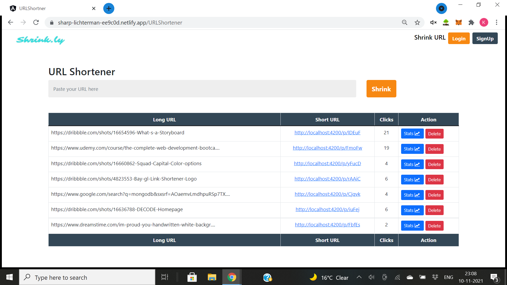
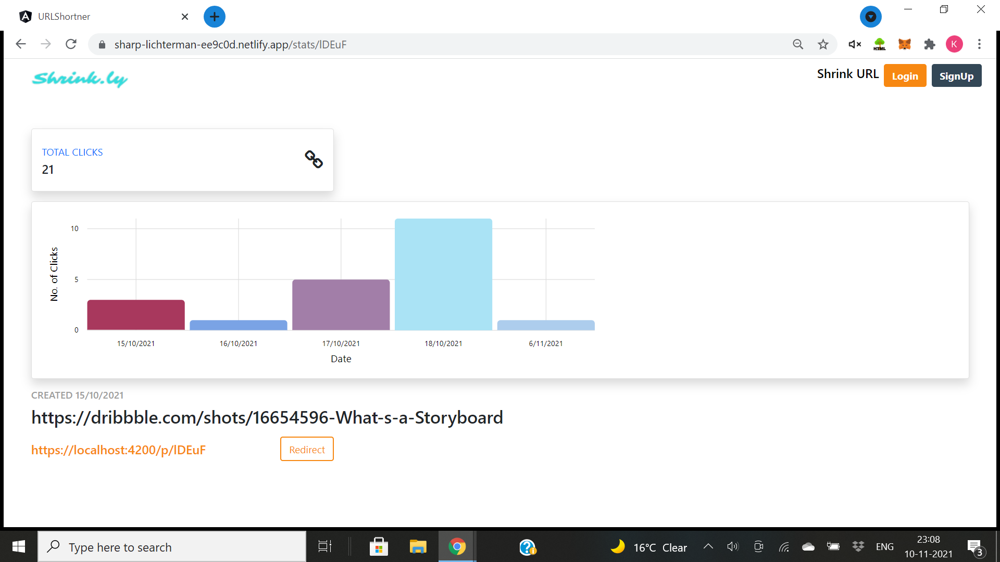

# URLShortner
 A URL Shortner App using Angular . It shortens the URL and keep a stats record about the link along with the number of clicks for a particular link.Integrated NGX charts for visualisation. 
## <a href="https://sharp-lichterman-ee9c0d.netlify.app">Check out the App</a>

 

